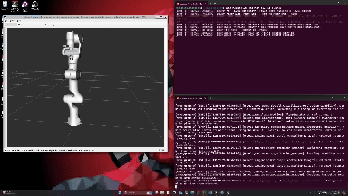

# 🦾 MoveIt Motion Planning with Panda Robot  
  

## 📌 Overview  
This project demonstrates a **pick-and-place motion planning** operation for the **Franka Emika Panda robotic arm** in a **simulated ROS 2 Humble environment** using **MoveIt**. The arm follows a trajectory between goal states while avoiding obstacles in **RViz2**.  

## 🚀 Features  
- **Motion Planning:** Moves the Panda robot between defined waypoints.  
- **Obstacle Avoidance:** Plans collision-free trajectories.  
- **Gripper Control:** Closes gripper at **goal1** and opens at **goal2**.  
- **MoveIt Setup Assistant:** Configures the Panda robot for motion planning.  
- **Dockerized Environment:** Runs ROS 2 Humble inside a container for reproducibility.  

---  

## 📂 File Structure  
```plaintext
📁 sai_jagadeesh_jagkrish/  
│── 📁 jagkrish_move_it_setup/ # MoveIt setup for Panda robot  
│   │── 📂 config/ # MoveIt configuration files  
│   │   │── initial_positions.yaml  
│   │   │── joint_limits.yaml  
│   │   │── kinematics.yaml  
│   │   │── moveit_controllers.yaml  
│   │   │── moveit.rviz  
│   │   │── panda.ros2_control.xacro  
│   │   │── panda.srdf  
│   │   │── panda.urdf.xacro  
│   │   │── pilz_cartesian_limits.yaml  
│   │   │── ros2_controllers.yaml  
│   │   │   
│   │── 📂 launch/ # Launch files for MoveIt & RViz  
│   │   │── demo.launch.py  
│   │   │── move_group.launch.py  
│   │   │── moveit_rviz.launch.py  
│   │   │── rsp.launch.py  
│   │   │── setup_assistant.launch.py  
│   │   │── spawn_controllers.launch.py  
│   │   │── static_virtual_joint_tfs.launch.py  
│   │   │── warehouse_db.launch.py  
│   │   │   
│   │── 📂 setup_assistant/ # MoveIt setup assistant files  
│   │── CMakeLists.txt  
│   │── package.xml  
│   │── 📁 package_jagkrish/ # Custom MoveIt package  
│   │── 📂 include/ # Include headers (if needed)  
│   │── 📂 src/ # Source files  
│   │   │── move_it_planner.cpp # Motion planning implementation  
│   │── CMakeLists.txt  
│   │── package.xml  
│── move_it.gif # Simulation demo GIF  
│── README.md # Project documentation  
```  

---  

## 🛠️ Installation & Setup  

### 1️⃣ Install Docker  
```bash
sudo snap install docker
sudo groupadd docker
sudo usermod -aG docker ${USER}
sudo chmod 666 /var/run/docker.sock
docker run hello-world
```  

### 2️⃣ Build and Run Docker Container  
```bash
cd Project4_docker
docker build . -t project4
sudo chmod +x ./create_container.sh
./create_container.sh my_panda_container
docker start my_panda_container
sudo chmod +x ./open_terminal.sh
./open_terminal.sh my_panda_container
```  

### 3️⃣ Install ROS 2 & MoveIt Inside the Container  
```bash
sudo apt-get update
sudo apt install gazebo
sudo apt install ros-humble-moveit
sudo apt-get install ros-humble*controller*
sudo apt-get install ros-humble*joint*state*
source /opt/ros/humble/setup.bash
```  

### 4️⃣ Launch Panda Robot in RViz  
```bash
source install/setup.bash
ros2 launch jagkrish_move_it_setup demo.launch.py
```  

---  

## 🎮 Running the Pick-and-Place Simulation  
- Move the Panda arm from **home → goal1 (pick) → goal2 (drop) → home**.  
- Ensure **gripper closes** at goal1 and **opens** at goal2.  
- Modify goal positions for custom trajectories.  

---  

## 📽️ Demo Videos  
- **Pick & Place Execution:** [Google Drive](https://drive.google.com/file/d/1TIF4ZqlVV9-VkcEwnztevxfMXs9tWfv/view?usp=drive_link) | [YouTube](https://www.youtube.com/watch?v=move_it_c++_script_setup_sai_jagadeesh_-_project4_-_ENPM661_-_120172243)  
- **MoveIt Setup Assistant Configuration:** [Google Drive](https://drive.google.com/file/d/1fB6Mb9JYd786DnoIRe52oMPRapM8ys5X/view?usp=drive_link) | [YouTube](https://www.youtube.com/watch?v=move_it_setup_sai_jagadeesh_muralikrishnan_-_project4_-_ENPM661_-_120172243)  

---  

## 🤖 Technologies Used  
- **ROS 2 Humble**  
- **MoveIt Motion Planning**  
- **Gazebo & RViz2**  
- **Docker**  
- **C++ (Motion Planner Implementation)**  

---  

## 📝 References  
- [MoveIt 2 Documentation](https://moveit.ros.org/)  
- [MoveIt Setup Assistant](https://moveit.ros.org/documentation/ros2/)  

---  

## 🔧 Author: Sai Jagadeesh Muralikrishnan  
📅 **Spring 2024**  
📌 **University of Maryland, College Park**  

⭐ *Feel free to ⭐ this repo if you find it useful!*
